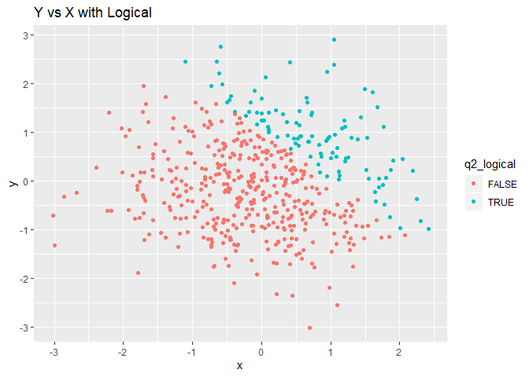
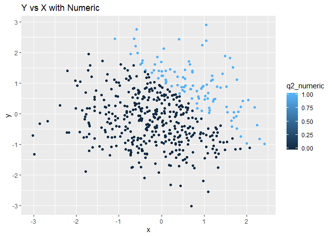

p8105\_hw1\_sz2800.Rmd
================
Stephanie Zhen
9/20/2019

``` r
library(tidyverse)
```

    ## -- Attaching packages ------------------------- tidyverse 1.2.1 --

    ## v ggplot2 3.2.1     v purrr   0.3.2
    ## v tibble  2.1.3     v dplyr   0.8.3
    ## v tidyr   0.8.3     v stringr 1.4.0
    ## v readr   1.3.1     v forcats 0.4.0

    ## -- Conflicts ---------------------------- tidyverse_conflicts() --
    ## x dplyr::filter() masks stats::filter()
    ## x dplyr::lag()    masks stats::lag()

### Q1: Create a data frame comprised of:

A random sample of size 8 from a standard Normal distribution.

A logical vector indicating whether elements of the sample are greater
than 0.

A character vector of length 8.

A factor vector of length 8, with 3 different factor “levels.”

``` r
hw1q1_df = tibble(
  ran_sample = rnorm(8),
  vec_logical = ran_sample > 0,
  vec_char = c("breakfast", "lunch", "dinner",  "sleep", "coffee", "stars", "nap", "snacks"),
  vec_factor = factor(c("morning", "afternoon", "night", "night", "morning", "night", "afternoon", "afternoon"))
)
```

##### Taking mean of ran\_sample, vec\_logical, vec\_char, vec\_factor

``` r
mean(pull(hw1q1_df, ran_sample))
```

    ## [1] -0.3051057

``` r
mean(pull(hw1q1_df, vec_logical))
```

    ## [1] 0.375

``` r
mean(pull(hw1q1_df, vec_char))
```

    ## Warning in mean.default(pull(hw1q1_df, vec_char)): argument is not numeric
    ## or logical: returning NA

    ## [1] NA

``` r
mean(pull(hw1q1_df, vec_factor))
```

    ## Warning in mean.default(pull(hw1q1_df, vec_factor)): argument is not
    ## numeric or logical: returning NA

    ## [1] NA

The mean for the numerical variable(ran\_sample) and the logical
variable were computed.

For vec\_char, and vec\_factors, it returns NA. This makes sense because
vec\_char and vec\_factors are not logicals nor numerics and thus the
means cannot be
computed.

##### Applying “as.numeric” function to the vec\_logical, vec\_char, and vec\_factor.

``` r
mean(as.numeric(pull(hw1q1_df, vec_logical)))
```

    ## [1] 0.375

``` r
mean(as.numeric(pull(hw1q1_df, vec_char)))
```

    ## Warning in mean(as.numeric(pull(hw1q1_df, vec_char))): NAs introduced by
    ## coercion

    ## [1] NA

``` r
mean(as.numeric(pull(hw1q1_df, vec_factor)))
```

    ## [1] 2

After applying as.numeric (), a mean value for the logical variable is
computed.

After applying as.numeric () for vec\_char, an error message was
returned: “NA was introduced by coercion”. The character variable can
not be cohereced into numeric values.

After applying as.numeric (), a mean for the factor variable can be
computed. The as.numeric() function was able to assign numerical values
to each
level.

##### Convert the logical vector to numeric, and multiply the random sample by the result.

``` r
as.numeric(pull(hw1q1_df, vec_logical)) * pull(hw1q1_df,ran_sample)
```

    ## [1] 0.0000000 0.0000000 0.6530727 0.0000000 0.4051346 0.0000000 0.0806250
    ## [8] 0.0000000

##### Convert the logical vector to a factor, and multiply the random sample by the result

``` r
as.factor(pull(hw1q1_df, vec_logical)) * pull(hw1q1_df,ran_sample)
```

    ## Warning in Ops.factor(as.factor(pull(hw1q1_df, vec_logical)),
    ## pull(hw1q1_df, : '*' not meaningful for factors

    ## [1] NA NA NA NA NA NA NA NA

Returns “NA,” becuase the factors are not numerical values (or logicals)
and thus unable to return a reasonable
answer.

##### Convert the logical vector to a factor and then convert the result to numeric, and multiply the random sample by the result.

``` r
as.numeric(as.factor(pull(hw1q1_df, vec_logical))) * pull(hw1q1_df,ran_sample)
```

    ## [1] -1.9135640 -0.3598102  1.3061453 -0.6248275  0.8102693 -0.0103047
    ## [7]  0.1612500 -0.6711719

### Q2:Create a data frame comprised of:

x: a random sample of size 500 from a standard Normal distribution

y: a random sample of size 500 from a standard Normal distribution

A logical vector indicating whether x + y \> 1

A numeric vector created by coercing the above logical vector

A factor vector created by coercing the above logical vector

``` r
hw1q2_df = tibble(
  x = rnorm(500),
  y = rnorm(500),
  q2_logical = x + y > 1,
  q2_numeric = as.numeric(q2_logical),
  q2_factor = as.factor(q2_logical)
)
```

Number of rows in dataframe, hw1q2\_df: 500

Number of columns in dataframe, hw1q2\_df: 5

Mean of dataframe, hw1q2\_df: -0.0536998

Median of dataframe, hw1q2\_df: -0.0591552

Standard deviation of dataframe, hw1q2\_df: 0.9570543

Proportions of cases for which x + y \> 1 in dataframe, hw1q2\_df:
0.202

##### ggplot\_1: Make ggplot y vs x using color = q2\_logical and exported plot using ggsave.

``` r
 ggplot_logical <- ggplot(hw1q2_df, aes(x = x, y = y, color = q2_logical)) + 
  geom_point()

print(ggplot_logical + ggtitle("Y vs X with Logical"))
```

<!-- -->

``` r
ggsave("hw1q2_df.pdf")
```

    ## Saving 7 x 5 in image

## ggplot\_2: Make ggplot y vs x using color = q2\_numeric.

``` r
ggplot_numeric <- ggplot(hw1q2_df, aes(x = x, y = y, color = q2_numeric)) + 
  geom_point()

print(ggplot_numeric + ggtitle("Y vs X with Numeric"))
```

<!-- -->

## ggplot\_3: Make ggplot y vs x using color = q2\_factor.

``` r
ggplot_factor <- ggplot(hw1q2_df, aes(x = x, y = y, color = q2_factor)) + 
  geom_point()

print(ggplot_factor + ggtitle("Y vs X with Factor"))
```

<!-- -->

The first and last plot with color = q2\_logical and color = q2\_factor
only two color points in the color legend becuase both both variables
have binary options. TRUE and FALSE for q2\_logical and 2 levels for the
q2\_factor. The second plot, q2\_numeric has a gradient of color,
because q2\_numeric is a numeric variable which means it is a continuous
variable. Therefore, we get a scale of color in the legend for
q2\_numeric. We only see the colors blue and black, because we get 0 and
1 as results (the two extremes on the scale).
